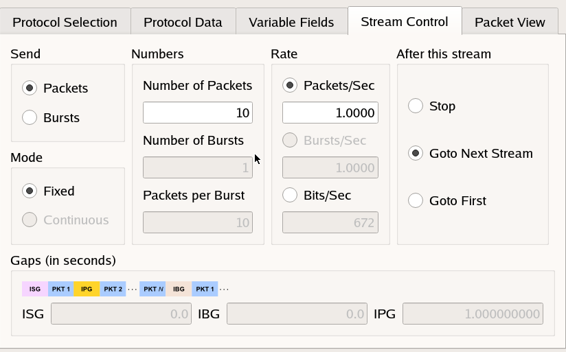

# (Q1)

So, firstly, it is critical to notice that this completely depends on what
Ostinato does "under the hood". Specifically, I would like to point out that
Ostinato itself is an application running in a Linux virtual machine which is
virtually connected to a docker container on the same machine. This of course
introduces another level of complexity which I do not believe is feasible to
consider here.

Also, I believe it is also not feasible to describe what Ostinato precisely does
internally as it requires an in depth knowledge of the Ostinato codebase.

Having said this, I will restrict myself to a very shallow explanation.

The two main OSI layers which concern the creation of device groups are the Data
Link (2nd) Layer and the Network (3rd) Layer.

When we create a device group we are forced to give that device group a base MAC
(Media Access Control) address. We have to pick also the number of devices which
the device group will have. In the case that there are more than one devices,
Ostinato will give the rest of the devices MAC addresses based on an address
offset which we specify. The MAC addresses are then used by Ostinato to
distinguish between these virtual devices at layer 2.

> **Note**: The uniqueness of the MAC addresses used is responsibility of the
> individual using Ostinato, although Ostinato seems to provide random MAC address
> which are unlikely to be already in use.

After we provide MAC addresses to the devices in the device group we also have
the option of choosing an Internet Protocol (IP) version and provide a base IP
address and an address offset to give each device a different IP address. This
essentially sets up the virtual devices for layer 3 functionality.

I think the above is a sufficient answer as delving into the actual details of
how these things are implemented is not trivial and would require an incredibly
large amount of work.

# (Q2.1)

| No. | Time        | Source       | Destination  | Protocol | Length | Info                                                             |                                  
| --- | ----------- | ------------ | ------------ | -------- | ------ | ---------------------------------------------------------------- |                                  
| 486 | 4617.638757 | 192.168.0.10 | 192.168.0.1  | ICMP     | 60     | Echo (ping) request  id=0x04d2, seq=0/0, ttl=127 (reply in 487)  |                                  
| 487 | 4617.638893 | 192.168.0.1  | 192.168.0.10 | ICMP     | 60     | Echo (ping) reply    id=0x04d2, seq=0/0, ttl=64 (request in 486) |                                  
| 488 | 4618.638764 | 192.168.0.10 | 192.168.0.1  | ICMP     | 60     | Echo (ping) request  id=0x04d2, seq=0/0, ttl=127 (reply in 489)  |                                  
| 489 | 4618.638848 | 192.168.0.1  | 192.168.0.10 | ICMP     | 60     | Echo (ping) reply    id=0x04d2, seq=0/0, ttl=64 (request in 488) |                                  
| 490 | 4619.638761 | 192.168.0.10 | 192.168.0.1  | ICMP     | 60     | Echo (ping) request  id=0x04d2, seq=0/0, ttl=127 (reply in 491)  |                                  
| 491 | 4619.638880 | 192.168.0.1  | 192.168.0.10 | ICMP     | 60     | Echo (ping) reply    id=0x04d2, seq=0/0, ttl=64 (request in 490) |                                  
| 492 | 4620.638772 | 192.168.0.10 | 192.168.0.1  | ICMP     | 60     | Echo (ping) request  id=0x04d2, seq=0/0, ttl=127 (reply in 493)  |                                  
| 493 | 4620.638890 | 192.168.0.1  | 192.168.0.10 | ICMP     | 60     | Echo (ping) reply    id=0x04d2, seq=0/0, ttl=64 (request in 492) |                                  
| 494 | 4621.638731 | 192.168.0.10 | 192.168.0.1  | ICMP     | 60     | Echo (ping) request  id=0x04d2, seq=0/0, ttl=127 (reply in 495)  |                                  
| 495 | 4621.638861 | 192.168.0.1  | 192.168.0.10 | ICMP     | 60     | Echo (ping) reply    id=0x04d2, seq=0/0, ttl=64 (request in 494) |                                  
| 496 | 4622.638714 | 192.168.0.10 | 192.168.0.1  | ICMP     | 60     | Echo (ping) request  id=0x04d2, seq=0/0, ttl=127 (reply in 497)  |                                  
| 497 | 4622.638914 | 192.168.0.1  | 192.168.0.10 | ICMP     | 60     | Echo (ping) reply    id=0x04d2, seq=0/0, ttl=64 (request in 496) |                                  
| 500 | 4623.638729 | 192.168.0.10 | 192.168.0.1  | ICMP     | 60     | Echo (ping) request  id=0x04d2, seq=0/0, ttl=127 (reply in 501)  |                                  
| 501 | 4623.638837 | 192.168.0.1  | 192.168.0.10 | ICMP     | 60     | Echo (ping) reply    id=0x04d2, seq=0/0, ttl=64 (request in 500) |                                  
| 502 | 4624.638727 | 192.168.0.10 | 192.168.0.1  | ICMP     | 60     | Echo (ping) request  id=0x04d2, seq=0/0, ttl=127 (reply in 503)  |                                  
| 503 | 4624.638831 | 192.168.0.1  | 192.168.0.10 | ICMP     | 60     | Echo (ping) reply    id=0x04d2, seq=0/0, ttl=64 (request in 502) |                                  
| 504 | 4625.638735 | 192.168.0.10 | 192.168.0.1  | ICMP     | 60     | Echo (ping) request  id=0x04d2, seq=0/0, ttl=127 (reply in 505)  |                                  
| 505 | 4625.638858 | 192.168.0.1  | 192.168.0.10 | ICMP     | 60     | Echo (ping) reply    id=0x04d2, seq=0/0, ttl=64 (request in 504) |                                  
| 506 | 4626.638725 | 192.168.0.10 | 192.168.0.1  | ICMP     | 60     | Echo (ping) request  id=0x04d2, seq=0/0, ttl=127 (reply in 507)  |                                  
| 507 | 4626.638833 | 192.168.0.1  | 192.168.0.10 | ICMP     | 60     | Echo (ping) reply    id=0x04d2, seq=0/0, ttl=64 (request in 506) |


The above embedded CSV is the wireshark capture. There are precisely 20 ICMP
packets. 10 requests and 10 replies.



The number of requests according to the stream settings is 10, which is
precisely what we observe.

# (Q2.2)

486, 488, 490, 492, 494, 496, 500, 502, 504 and 506 are the numbers
associated with the request packets generated by Ostinato.

487, 489, 491, 493, 495, 497, 501, 503, 505 and 507 are the numbers
associated with the reply packets sent by the DUT (Device Under Test).

# (Q2.3)

$$
\begin{aligned}
&\frac{
\begin{aligned}
&(4618.638764 - 4617.638757)
+(4619.638761 - 4618.638764)
+(4620.638772 - 4619.638761)\\
+\ &(4621.638731 - 4620.638772)
+(4622.638714 - 4621.638731)
+(4623.638729 - 4622.638714)\\
+\ &(4624.638727 - 4623.638729)
+(4625.638735 - 4624.638727)
+(4626.638725 - 4625.638735)
\end{aligned}
}{10 - 1}\\
=\ & 0.9999964444444535\ \text{seconds}
\end{aligned}
$$

The above computed value is the average interpacket gap i.e. the delay between
request packets in seconds. It is approximately 1 second which is precisely what
was set in the stream settings. As is clearly visible in the above picture.

Below is the Python 3 expression used to calculate the above value.

```python
((4618.638764 - 4617.638757)
+(4619.638761 - 4618.638764)
+(4620.638772 - 4619.638761)
+(4621.638731 - 4620.638772)
+(4622.638714 - 4621.638731)
+(4623.638729 - 4622.638714)
+(4624.638727 - 4623.638729)
+(4625.638735 - 4624.638727)
+(4626.638725 - 4625.638735))/9
```

# (Q3)

Below is picture of the updated settings.


And below here you can find the new capture.

| No. | Time       | Source       | Destination  | Protocol | Length | Info                                                            |                                    
| --- | ---------- | ------------ | ------------ | -------- | ------ | --------------------------------------------------------------- |                                    
| 16  | 140.926179 | 192.168.0.10 | 192.168.0.1  | ICMP     | 60     | Echo (ping) request  id=0x04d2, seq=0/0, ttl=127 (reply in 17)  |                                    
| 17  | 140.926306 | 192.168.0.1  | 192.168.0.10 | ICMP     | 60     | Echo (ping) reply    id=0x04d2, seq=0/0, ttl=64 (request in 16) |                                    
| 18  | 141.426171 | 192.168.0.10 | 192.168.0.1  | ICMP     | 60     | Echo (ping) request  id=0x04d2, seq=0/0, ttl=127 (reply in 19)  |                                    
| 19  | 141.426320 | 192.168.0.1  | 192.168.0.10 | ICMP     | 60     | Echo (ping) reply    id=0x04d2, seq=0/0, ttl=64 (request in 18) |                                    
| 20  | 141.926165 | 192.168.0.10 | 192.168.0.1  | ICMP     | 60     | Echo (ping) request  id=0x04d2, seq=0/0, ttl=127 (reply in 21)  |                                    
| 21  | 141.926287 | 192.168.0.1  | 192.168.0.10 | ICMP     | 60     | Echo (ping) reply    id=0x04d2, seq=0/0, ttl=64 (request in 20) |                                    
| 22  | 142.426145 | 192.168.0.10 | 192.168.0.1  | ICMP     | 60     | Echo (ping) request  id=0x04d2, seq=0/0, ttl=127 (reply in 23)  |                                    
| 23  | 142.426254 | 192.168.0.1  | 192.168.0.10 | ICMP     | 60     | Echo (ping) reply    id=0x04d2, seq=0/0, ttl=64 (request in 22) |                                    
| 24  | 142.926106 | 192.168.0.10 | 192.168.0.1  | ICMP     | 60     | Echo (ping) request  id=0x04d2, seq=0/0, ttl=127 (reply in 25)  |                                    
| 25  | 142.926275 | 192.168.0.1  | 192.168.0.10 | ICMP     | 60     | Echo (ping) reply    id=0x04d2, seq=0/0, ttl=64 (request in 24) |                                    
| 26  | 143.426150 | 192.168.0.10 | 192.168.0.1  | ICMP     | 60     | Echo (ping) request  id=0x04d2, seq=0/0, ttl=127 (reply in 27)  |                                    
| 27  | 143.426249 | 192.168.0.1  | 192.168.0.10 | ICMP     | 60     | Echo (ping) reply    id=0x04d2, seq=0/0, ttl=64 (request in 26) |                                    
| 28  | 143.926104 | 192.168.0.10 | 192.168.0.1  | ICMP     | 60     | Echo (ping) request  id=0x04d2, seq=0/0, ttl=127 (reply in 29)  |                                    
| 29  | 143.926259 | 192.168.0.1  | 192.168.0.10 | ICMP     | 60     | Echo (ping) reply    id=0x04d2, seq=0/0, ttl=64 (request in 28) |                                    
| 30  | 144.426138 | 192.168.0.10 | 192.168.0.1  | ICMP     | 60     | Echo (ping) request  id=0x04d2, seq=0/0, ttl=127 (reply in 31)  |                                    
| 31  | 144.426250 | 192.168.0.1  | 192.168.0.10 | ICMP     | 60     | Echo (ping) reply    id=0x04d2, seq=0/0, ttl=64 (request in 30) |                                    
| 32  | 144.926075 | 192.168.0.10 | 192.168.0.1  | ICMP     | 60     | Echo (ping) request  id=0x04d2, seq=0/0, ttl=127 (reply in 33)  |                                    
| 33  | 144.926259 | 192.168.0.1  | 192.168.0.10 | ICMP     | 60     | Echo (ping) reply    id=0x04d2, seq=0/0, ttl=64 (request in 32) |                                    
| 34  | 145.426128 | 192.168.0.10 | 192.168.0.1  | ICMP     | 60     | Echo (ping) request  id=0x04d2, seq=0/0, ttl=127 (reply in 35)  |                                    
| 35  | 145.426236 | 192.168.0.1  | 192.168.0.10 | ICMP     | 60     | Echo (ping) reply    id=0x04d2, seq=0/0, ttl=64 (request in 34) |

Again the number of packets in total is 20. 10 requests and 10 replies as specified in the stream.

The request packets are precisely numbers: 16, 18, 20, 22, 24, 26, 28, 30, 32, 34.

The reply packets are precisely numbers: 17, 19, 21, 23, 25, 27, 29, 31, 33, 35.

The average interpacket gap is roughly 0.5 seconds as calculated
below. This is also as expected as we increased the number of
packets per second from 1 to 2.

$$
\begin{aligned}
&\frac{
\begin{aligned}
&(141.426171 - 140.926179)
+(141.926165 - 141.426171)
+(142.426145 - 141.926165)\\
+\ &(142.926106 - 142.426145)
+(143.426150 - 142.926106)
+(143.926104 - 143.426150)\\
+\ &(144.426138 - 143.926104)
+(144.926075 - 144.426138)
+(145.426128 - 144.926075)
\end{aligned}
}{10 - 1}\\
=\ & 0.499994333333335\ \text{seconds}
\end{aligned}
$$

Below is the Python 3 expression used to calculate the above
value.

```python
((141.426171 - 140.926179)
+(141.926165 - 141.426171)
+(142.426145 - 141.926165)
+(142.926106 - 142.426145)
+(143.426150 - 142.926106)
+(143.926104 - 143.426150)
+(144.426138 - 143.926104)
+(144.926075 - 144.426138)
+(145.426128 - 144.926075))/9
```

# (Q4.1)

The two packets under consideration are the ones below.


The info related to the to the request from the generator to the
DUT is provided below. Specifically, the information related to
the Ethernet II frame.


The number of bytes capture by Wireshark is exactly $60$ bytes.

# (Q4.2)


> *Reference*: https://upload.wikimedia.org/wikipedia/commons/7/72/Ethernet_Frame.png
> 
> **Note**: There is a mistake in the graphic. "CRC/FSC" should
> be "CRC/FCS" and "FSC (Frame check sequence)" should be "FCS
> (Frame check sequence)".

The minimum and maximum lengths can be derived from the above
image using the fact that the Ethernet Frame at Layer 2 is
comprised of the following segments: 

- Destination MAC ($6$ octets);
- Source MAC ($6$ octets);
- 802.1Q Header (optional & $4$ octets);
- EtherType ($2$ octets);
- Payload ($42$ - $1500$ octets with 802.1Q & $46$ - $1500$ octets without 802.1Q); and
- CRC/FCS ($4$ octets).

Hence we can perform the following calculation for the minimum
length:

$$
{\text{Frame}}_{\text{min}} = 6 + 6 + 2 + 46 + 4 = 64\ \text{octets}
$$

> **Note**: In the case when we do not have a 802.1Q Header we
> get $0 + 46 = 46$ octets combined since the header has $0$
> length and the Payload has a minimum length of $46$. In the
> other case i.e. when we have a 802.1Q Header we get $4 + 42 = 46$
> octets which is exactly the same as when we do not have a
> 802.1Q Header. Hence, both cases are identical.

Similarly, the maximum length is given by the following
calculation:

$$
{\text{Frame}}_{\text{max}} = 6 + 6 + 2 + 1500 + 4 = 1518\ \text{octets}
$$

# (Q4.3)

The number of "bytes the wire" according to Wireshark is
precisely $60$ bytes. However, the minimum number of bytes is at
least $64$. Hence, we have $4$ bytes which are missing.

Now notice that the Ethernet Header does not contain an 802.1Q
Header. Hence we are allowed $46$ bytes of Payload. These are
all used up by our ICMP Request (including all IP overhead).


Hence the Ethernet Header and ICMP Request total $60$ bytes.
This means that our missing field is the Cyclic Redundancy Check
(CRC) or Frame Check Sequence (FCS). This field is precisely $4$
bytes and describes our discrepancy.

This is further supported by the following Wireshark forum
discussion which exclaims that "bytes on wire" is actually
"bytes on wire without CRC".

> *Reference*: https://osqa-ask.wireshark.org/questions/1344/does-frame-length-include-also-crc-bytes

# (Q4.4)

Here are the source and destination addresses of the request as
observed above.

Source MAC = `90:00:01:a9:41:f1`

Destination MAC = `be:98:b5:5f:fb:a8`

# (Q4.5)


> **Note**: Since the device group contains as single device the
> base MAC address i.e. `90:00:01:a9:41:f1` is used for that
> device.

The MAC address of our virtual device is `90:00:01:a9:41:f1`.

# (Q4.6)

> **Note**: Assuming that in the question, 5.4 and 5.5 where
> meant to be 4.4 and 4.5 respectively.

As we expected, the MAC Address of the virtual device is
identical to the Source MAC Address in the packet. This is
because of the fact that the packet is a Request packet i.e. it
was create by Ostinato.

It is also critical to point out that the request is very much
dependant on ARP (Address Resolution Protocol) requests to
establish who has the which is MAC addresses.

# (Q4.7)

In previous sections I have reference the EtherType or Type
field. I also included a picture of the Ethernet Header of the
Request packet.

The Type field is set to `0x0800` which refers to IPv4. Hence,
the receiver will understand that the Payload is an IPv4 packet
and it will be able to decode it.

# (Q4.8)


Source IP Address = `192.168.0.10`

Destination IP Address = `192.168.0.1`

These are precisely, the values we defined in the stream as can
be seen below.


Additionally, the Total Length is $46$ bytes. This is precisely
what we described before hand. The Ethernet Header Length is
$14$ bytes, and $14 + 46 = 60$ bytes as expected.

We can also be a bit more specific and point out that $20$ of
the $46$ bytes are the IPv4 Header Length whilst the remaining
$26$ bytes are the actual ICMP Request.

# (Q5)


The above four pictures are all the Wireshark captures as
specified in the lab sheet.

All we have to do is notice that the addresses in use are
`192.168.0.10` and `192.168.0.3`. The important thing to note is
that these are the IP addresses of the virtual Ostinato device
and the Alpine-3 Docker Container.

And we are doing so even though all these captures happened on
the wire between Hub1 and Apline-1. This essentially, exposes
the nature of the Hub as a networking device. Specifically, the
Hub acts as a broadcasting relay. It does not send packets only
where they are required, it takes a broad stroke approach and
replays the packet it receives to every other connection to the
Hub.

# (Q6)

So, for this question we will repeat all the steps described in
Phase 1, Part 2. However, this time we will use Port 1 or eth2()
(in Ostinato) and  monitor both connections i.e. Switch1 to
apline-2 and Swtich1 to apline-4.

This is because this will allows us to understand the nature of
Switch compared to a Hub.


Firstly, it is important to note that we only actually capture a
single packet on the Switch <-> Apline 2 connection as clearly
established by the pictures above, specifically Switch to Apline
2 Part 1 and Swithc to Apline 2 Part 2.

Additionally, the only difference between my output and that
present in Fig. 37 of the lab sheet is the MAC address. However,
this could have also been made the same since the MAC address
can be set by the user of Ostinato.

# (Q7.1)


> **Note**: There are two screenshots is because I split the
> capture into two separate captures.

The above two screenshots show the packets captured over the
Switch <-> Alpine 4 connection.

# (Q7.2)

So, from here onwards I will refer to the packets with there No.
as marked in the previous two screenshots. Specifically, these
are 65, 66 & 10, 11, 12, 13.

- Now 12 and 13 form part of the ARP request which apline-4
autonomously inserts as described in the lab sheet.
Specifically, 12 is the request and 13 is the reply.

- 65 and 66 are the initial packets sent and these constitute
the initial stage when we apply our configuration from within
Ostinato. These packets form part of an ARP correspondence. ARP
is used to establish whether or not the entity associated with
the specified IP address is also an L2 entity in our local
network. Additionally, if the entity is an L2 entity it replies
back with its MAC address. This procedure happens via an initial
request for discovery. In our case this request is 65. The
device initiating ARP will broadcast an ARP request requesting
the MAC Address of the current holder of the specified IP. Each
device on the local network will receive this ARP request and
then they will proceed to check whether or not they
have the requested IP address. If they do they will send there
MAC address as a unicast ARP request since the MAC address of
the initiator is known since it would be the source MAC address
in the initial broadcast. What I am describing is essentially,
packet No. 66.

- Finally, we shall discuss the actual interesting packets,
specifically 10 and 11. The ICMP request 10, is sent when we
execute the stream we created in Ostinato. ICMPs are meant to
check whether a device with the specified IP exists and whether
it can service our request. This is the case for us and we get
back a reply to our request. As can be seen the request is No. 11.

# (Q7.3)


